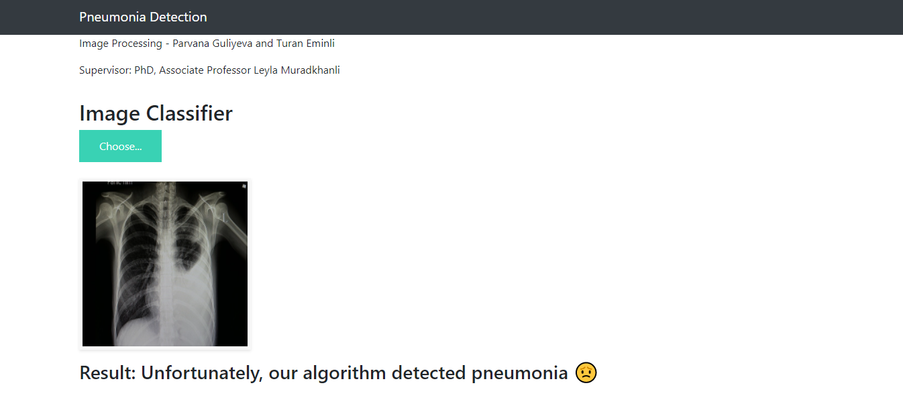

# Pneumonia detection

This project aims to detect Pneumonia based on the lung images taken from the publicly available Kaggle dataset containing 5216 train images, 624 test images, and 16 validation images with two categories: NORMAL and PNEUMONIA.

## Installation without Docker

First, install github repository to your local machine.

```bash
git clone https://github.com/turaneminli/pneumonia-detection.git
```

Then, to run without docker create virtual environment for package control.

```bash
python -m venv myenv
```

Activate, virtual environment.

### In Windows

```bash
.\myenv\Scripts\activate
```

### In Linux

```bash
source myenv/Scripts/activate
```

After that, install dependencies

```bash
pip install -r requirements.txt
```

## Installation with Docker

Run the following script in root folder.

```bash
docker build -t pneumonia .
```

After building image run the docker container.

```bash
docker run -p 5000:5000 pneumonia
```

After that you can check the result on port 5000 on your localhost, thanks to port mapping in run command.

## Executing code

```bash
python app.py
```

or

```bash
flask run
```

## Interface and localhost

Then, the program should run on port 5000 in your localhost (127.0.0.1:5000).

The final look of user interface should be as following:


